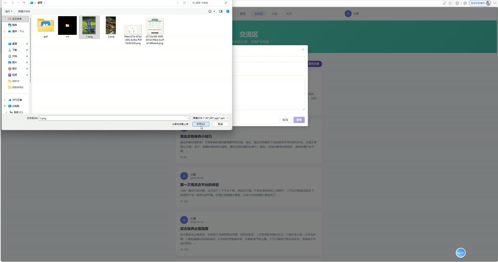
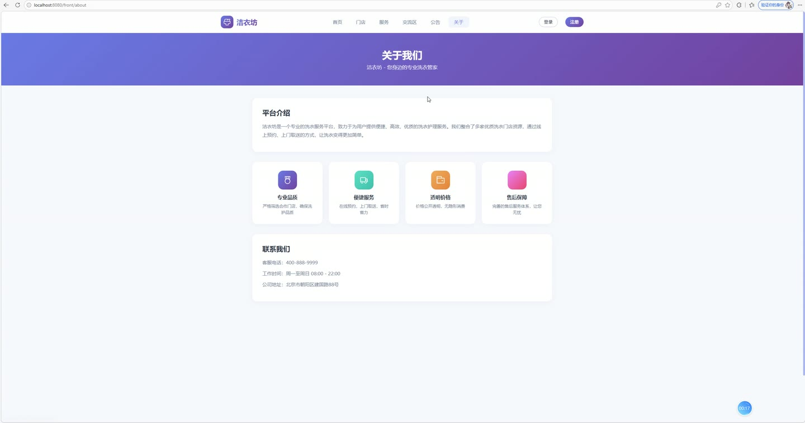
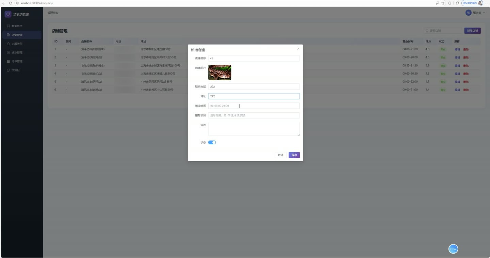
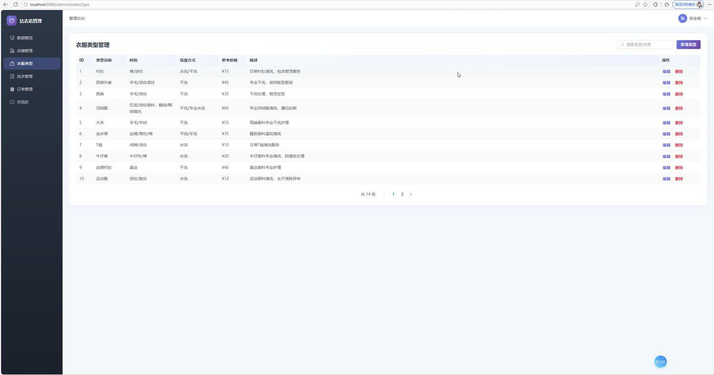
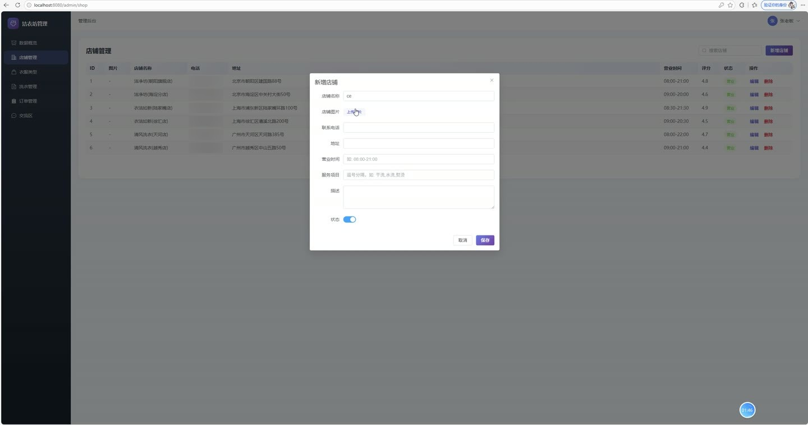

# (附文档)Springboot3+Vue3+MySQL 洗衣店订单管理系统

**技术栈**：Springboot3、Vue3、MySQL

### 系统简介

洁衣坊洗衣店订单管理系统是一款基于SpringBoot3与Vue3的前后端分离Web应用，提供用户端、管理员端、店家端三类角色入口。系统覆盖洗衣服务全流程，包括在线下单、订单支付、洗衣进度跟踪、店铺管理、文章交流、公告发布及数据统计等功能，帮助洗衣门店实现数字化运营管理。
 
### 核心功能
 
### 普通用户端

- 注册/登录：支持用户自主注册（用户名唯一性校验）、密码登录、账号禁用校验，登录成功后签发JWT Token

- 个人信息维护：支持修改昵称、手机号、邮箱、头像、地址等个人资料，且角色与密码字段不可通过此接口变更

- 密码修改：需校验原密码正确性，通过后设置新密码

- 浏览店铺列表：查看状态为启用的门店，展示门店名称、地址、营业时间、评分、服务项目等信息

- 查看店铺详情：获取单个门店的完整介绍、联系电话、营业时间等详细信息

- 浏览衣物类型：查看系统维护的衣物类型列表（类型名称、材质、洗涤方式、参考价格、描述）

- 在线提交洗衣订单：选择门店、衣物类型、填写数量、备注，系统自动生成订单编号（ORD+时间戳+随机数），并根据衣物单价与数量自动计算总价，初始状态为待支付

- 订单支付：对待支付订单执行支付操作，支付后订单状态变更为已支付，并记录支付时间

- 取消订单：对未完成订单执行取消操作，订单状态变更为已取消

- 查看我的订单：分页查看个人订单列表，展示订单编号、门店名称、衣物类型、数量、总价、状态、下单时间

- 提交洗衣预约：填写门店、衣物类型、数量、取衣地址、期望取衣时间及特殊要求，提交后状态为待审核

- 查看我的预约：分页查看个人洗衣预约记录，展示门店名称、衣物类型、状态及审核备注

- 浏览交流区文章：分页查看文章列表，展示作者昵称、标题、封面、浏览量、发布时间

- 查看文章详情：查看完整文章内容，每次访问自动增加浏览量

- 发表文章：登录用户可发布新文章，填写标题、内容、封面，初始浏览量为0

- 文章评论：对文章发表评论，评论列表展示评论者昵称、头像、内容与时间

- 删除自己的评论：支持删除个人发布的评论

- 浏览公告：查看状态为已发布的公告列表，按发布时间倒序排列

- 浏览轮播图：查看前台展示的启用的轮播图，按排序值升序排列

- 浏览洗衣服务：查看系统维护的衣物类型与洗涤价格服务列表
 
### 管理员端

- 数据概览：统计并展示系统用户总数、店铺总数、订单总数、文章总数、洗衣预约总数、店家总数

- 用户管理：分页查询用户列表，支持按用户名/昵称/手机号关键字搜索，支持按角色过滤，展示用户角色、状态、注册时间

- 用户状态管理：管理员可修改用户资料（不含密码与角色），实现账号启用/禁用

- 删除用户：删除指定用户记录

- 顾客管理：查看系统中所有普通用户（角色为USER）的列表，支持关键字搜索

- 店家管理：分页查询店家列表，支持按姓名/手机号搜索，可新增、编辑、删除店家信息，管理店家状态

- 店铺管理：分页查询店铺列表，支持按店铺名称/地址关键字搜索，可新增、编辑、删除店铺，管理店铺上下架状态

- 衣物类型管理：分页查询衣物类型，支持按类型名称/材质关键字搜索，可新增、编辑、删除衣物类型，维护类型名称、材质、洗涤方式、参考价格、描述

- 洗衣预约审核：查看全部洗衣预约列表（含用户昵称、门店名称、衣物类型），对预约进行审核通过或驳回，并填写审核备注

- 订单管理：查看全平台订单列表（含用户昵称、门店名称、衣物类型、总价、状态、支付时间、完成时间），可更新订单状态（待支付/已支付/进行中/已完成/已取消），订单完成时自动记录完成时间

- 删除订单：删除指定订单记录

- 交流区管理：查看全部文章列表（含作者、浏览量），可删除违规文章

- 公告管理：发布、编辑、删除公告，设置公告标题、内容、发布/下架状态

- 轮播图管理：新增、编辑、删除轮播图，支持上传本地图片或填写图片URL，设置排序值与显示/隐藏状态
 
### 店家端

- 数据概览：查看系统统计的用户数、店铺数、订单数、文章数、洗衣预约数、店家数

- 店铺管理：查看店铺列表，可新增、编辑、删除店铺，维护店铺名称、图片、电话、地址、营业时间、服务项目、描述、评分、状态

- 衣物类型管理：查看衣物类型列表，可新增、编辑、删除衣物类型，维护类型名称、材质、洗涤方式、参考价格、描述

- 洗衣预约管理：查看用户提交的洗衣预约列表（含用户昵称、门店名称、衣物类型、数量、取衣地址、期望时间），对预约进行审核通过或驳回，并填写审核备注

- 订单管理：查看平台订单列表，可更新订单状态（待支付/已支付/进行中/已完成/已取消），订单完成时自动记录完成时间

- 交流区管理：查看文章列表（含作者、浏览量），可删除违规文章
 
### 技术栈

后端框架Spring Boot 3.x
ORM框架MyBatis-Plus（含分页插件、逻辑删除、字段自动填充）
权限认证JWT（拦截器校验Token，排除登录/注册/前台接口）
前端框架Vue 3（Composition API + Script Setup）
状态管理Pinia（用户信息与Token存储）
UI组件库Element Plus
构建工具Vite
路由模式Vue Router（History模式，含路由守卫）
数据库MySQL 8.x
文件存储本地磁盘上传（UUID重命名，支持图片/文件）
 
### 交付内容

- 后端完整源码

- 前端完整源码

- 数据库初始化脚本

- 万字文档

## 界面展示

---

## 获取完整源码 + 万字文档

本仓库为项目介绍页。**完整前后端源码、数据库初始化脚本、万字项目文档**，请加微信 `kangkangcode`，或访问 [codekk.top](http://codekk.top) 获取。

可作课程设计 / 毕业设计参考，支持远程部署调试。